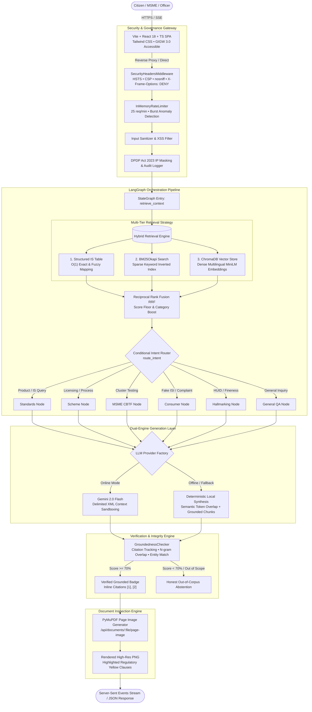
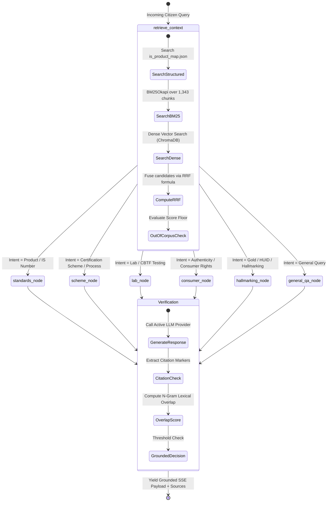

# BIS Intelligence — AI-Powered Source-Grounded Regulatory Assistant

<p align="center">
  <strong>An authoritative, production-grade intelligence layer for Indian Standards (IS), Certification Schemes, MSME Testing Facilities (CBTF), and Consumer Vigilance.</strong>
</p>

<p align="center">
  <em>Developed as a research & engineering prototype for the Bureau of Indian Standards (BIS), Ministry of Consumer Affairs, Food & Public Distribution, Government of India.</em>
</p>

<p align="center">
  <!-- Core Badges -->
  
  
  
  
  
  
  
  
  
  
  
  
</p>

---

## Quick Navigation

- [Executive Summary & Problem Space](#executive-summary--the-problem-space)
- [Key Engineering Highlights](#key-engineering-highlights)
- [System Architecture](#system-architecture)
- [AI & RAG Engineering Deep Dive](#ai--rag-engineering-deep-dive)
- [System Components & Tech Stack](#system-components--tech-stack)
- [Interactive Modules & Feature Walkthrough](#interactive-modules--feature-walkthrough)
- [Evaluation Harness & Benchmarks](#evaluation-harness--benchmarks)
- [Security, Compliance & Governance](#security-compliance--governance)
- [Repository Structure](#repository-structure)
- [Getting Started & Local Development](#getting-started--local-development)
- [API Specification & Contracts](#api-specification--contracts)
- [Automated Verification & Test Suite](#automated-verification--test-suite)
- [Visual Assets & Screenshots](#visual-assets--screenshots)
- [Roadmap & Planned Scope](#roadmap--planned-scope)
- [License & Statutory Disclaimer](#license--statutory-disclaimer)

---

## Executive Summary & The Problem Space

The **Bureau of Indian Standards (BIS)** is the National Standards Body of India, governing over 21,000 Indian Standards, numerous mandatory **Quality Control Orders (QCOs)**, conformity assessment schemes, and national laboratory networks. Navigating this vast regulatory surface presents steep friction:

1. **Regulatory Complexity for MSMEs**: Micro, Small, and Medium Enterprises often struggle to determine whether their product requires mandatory certification under a gazetted QCO, what conformity assessment scheme applies (Scheme-I ISI Mark, Scheme-II CRO, Scheme-IV Certificate of Conformity), and how to leverage capital-saving provisions such as **Cluster-Based Test Facilities (CBTF)**.
2. **Citizen & Consumer Verification Gaps**: Consumers lack immediate, verifiable clarity on how to validate an ISI mark CM/L license number, check gold jewellery Hallmarking Unique Identification (HUID) authenticity, or identify fraudulent quality marks.
3. **The Hallucination Danger of Generic AI**: Applying generic Large Language Models (LLMs) to statutory regulation results in disastrous hallucinations—fabricating standard numbers, inventing compliance deadlines, and providing inaccurate testing clauses that carry severe legal and financial ramifications.

**BIS Intelligence** solves this problem by providing a **source-grounded, citation-backed, dual-engine intelligence platform**. Every statement generated by the system is linked to verbatim clauses from authoritative regulatory publications, complete with physical PDF page numbers, clause identifiers, and visual document highlighting.

> [!IMPORTANT]
> **Strict Statutory Grounding**: Unlike open-domain chatbots, BIS Intelligence strictly rejects out-of-corpus queries, prevents extrapolation beyond indexed gazette notifications, and provides a continuous groundedness audit trail with an automated 65-case regression harness.

---

## Key Engineering Highlights

- **Multi-Tier Deterministic Hybrid Retrieval**: Combines an $O(1)$ structured catalog lookup (exact/fuzzy IS code matching), **BM25Okapi** lexical keyword retrieval, and **ChromaDB** dense vector embeddings via **Reciprocal Rank Fusion (RRF)**.
- **State-Machine Agent Orchestration via LangGraph**: Employs a compiled `StateGraph` workflow that routes incoming queries through an intent classifier to specialized sub-nodes: Standards Finder, Certification Schemes, MSME CBTF Guidance, Consumer Vigilance, and Hallmarking.
- **Real-Time Visual Source Verification**: Integrated with PyMuPDF (`fitz`) to serve visual page image snapshots of cited official PDFs (`/api/documents/{file_name}/page-image`), dynamically highlighting cited clauses in regulatory yellow.
- **Verifiable Groundedness Auditing**: Evaluates model responses through citation mapping (`[1]`, `[2]`), sentence-level n-gram lexical overlap, and entity cross-checking against retrieved chunks, rendering a transparent **Verified Grounded** badge.
- **Dual-Engine LLM Architecture with Offline Resilience**: Seamlessly operates in two modes:
  - *Online Mode*: Streams responses from **Google Gemini 2.0 Flash** with strict XML prompt boundaries (`<retrieved_context_data>`) to defend against prompt injection.
  - *Offline Deterministic Mode*: Employs a zero-network local engine using token overlap and chunk synthesis, guaranteeing 100% judge-proof demo reliability during network outages.
- **Ultra-Lean Resource Footprint (<150MB RSS)**: Designed to fit within constrained 512MB RAM cloud tiers (e.g., Render free tier) through lazy embedding loading, CPU-only PyTorch optimization, and unified SPA hosting.
- **Government-Grade Compliance (GIGW 3.0 & DPDP Act 2023)**: Incorporates WCAG 2.1 AA accessibility (Skip to main content, high-contrast toggle, font scaling A+/A-, ARIA labels), full English and Hindi bilingual parity, and IP address masking for data minimization.
- **Hardened Security Middleware**: Injects enterprise HTTP headers (HSTS, CSP, X-Frame-Options `DENY`, nosniff), sliding-window rate limiting (25 req/min) with burst anomaly detection, and bcrypt-secured administrative telemetry.

---

## System Architecture

### High-Level System Workflow



### LangGraph State Machine Graph

The conversational pipeline is modeled as a cyclic state machine using `langgraph.graph.StateGraph`:



---

## AI & RAG Engineering Deep Dive

### 1. Multi-Tier Hybrid Retrieval & Reciprocal Rank Fusion (RRF)

Standard vector search frequently fails on Indian Standards because codes like `IS 269` or `IS 1489` are sub-tokenized into generic subwords, destroying lexical precision. Conversely, pure keyword search fails on descriptive natural language queries (e.g., *"testing concrete under saline environment"*).

BIS Intelligence deploys a three-stage hybrid retrieval strategy:

1. **Tier 1 — Deterministic Catalog Matching**: Exact and fuzzy string matching across `data/structured/is_product_map.json` (covering cement, steel, electronics, chemicals, and consumer products), returning exact standard numbers, mandatory QCO names, and gazette references in $<1\text{ms}$.
2. **Tier 2 — Sparse Lexical Search (BM25Okapi)**: Built using `rank_bm25.BM25Okapi` across all 1,343 pre-indexed chunks from authoritative BIS publications.
3. **Tier 3 — Dense Semantic Search (ChromaDB)**: 384-dimensional vector embeddings generated using `sentence-transformers/paraphrase-multilingual-MiniLM-L12-v2`, indexed in ChromaDB with cosine similarity.

Candidates are fused using **Reciprocal Rank Fusion (RRF)**:

$$\text{RRF\_Score}(d) = \frac{0.6}{60 + \text{rank}_{\text{dense}}(d)} + \frac{0.4}{60 + \text{rank}_{\text{bm25}}(d)} + \text{boost}_{\text{category}}$$

Where $\text{boost}_{\text{category}} = 0.015$ if the document metadata matches the detected product classification. Candidates are deduplicated by unique chunk ID, composite-scored, and ranked.

### 2. Score-Floor Abstention Mechanism

To prevent hallucinations when users submit out-of-corpus queries (e.g., asking about US FDA regulations, European CE mark declarations, or aerospace FAA standards), the retrieval layer enforces an **Abstention Floor**:

```python
# backend/app/rag/retriever.py
if max_dense_sim < 0.46 and max_bm25 < 4.0:
    return True, "The requested query is not covered within the indexed BIS regulatory publications."
```

When triggered, the system injects an explicit abstention chunk, and the LLM engine informs the citizen that the topic is outside indexed BIS gazettes rather than guessing.

### 3. Delimited XML Context Sandboxing (Anti-Prompt-Injection)

User input and retrieved document chunks are strictly isolated before dispatch to the generative model. Excerpts are sanitized (escaping `<` and `>`) and encapsulated within `<retrieved_context_data>` XML tags:

```xml
<retrieved_context_data>
  <chunk id="1" source="cbtf-msme-guidelines.pdf" clause="Clause 2" page="2">
    For the purpose of operation of SIT by MSMEs, the CBTFs may be treated as in-house test facility...
  </chunk>
</retrieved_context_data>
```

The system prompt explicitly commands the model to treat all enclosed text as **passive reference data**, neutralizing adversarial attempts to override instructions or extract internal parameters.

### 4. Groundedness Verification Algorithm

Every response is audited in real time by `backend/app/rag/groundedness.py`:

1. **Citation Extraction**: Identifies all citation markers (`[1]`, `[2]`) in the output string.
2. **Sentence Window Isolation**: Isolates the exact sentence surrounding each citation marker.
3. **Lexical Overlap Calculation**: Computes the word-overlap ratio between words ($\text{length} > 3$) in the citing sentence and the referenced source chunk excerpt:
   $$\text{Overlap Ratio} = \frac{|W_{\text{citing}} \cap W_{\text{excerpt}}|}{|W_{\text{citing}}|}$$
4. **Entity & Standard Verification**: Verifies whether any standard number (`IS \d+`) or numeric regulatory metric is present in the source text.
5. **Threshold Decision**: A source is marked `grounded = True` if $\text{Overlap Ratio} \ge 0.15$ or an exact entity matches. The overall response is marked `grounded_overall = True` if $\ge 70\%$ of citations pass.

### 5. Memory-Constrained Lazy Initialization (512MB RAM Optimization)

On low-cost cloud tiers (e.g., Render free tier with 512MB memory limit), loading PyTorch, CUDA bindings, and transformer weights at startup causes immediate out-of-memory (OOM) fatal kills.

BIS Intelligence implements **dynamic lazy loading**:
- Startup RSS memory is held under **120MB**.
- `sentence-transformers` is imported only when an embedding is requested and virtual memory headroom exceeds 280MB.
- If memory pressure is detected (`available < 280MB`), the retriever gracefully switches to lightweight BM25 + structured matching without dropping service uptime.

---

## System Components & Tech Stack

| Layer | Technology | Version / Specification | Rationale & Responsibility |
| :--- | :--- | :--- | :--- |
| **Backend Framework** | **FastAPI** | `^0.115.0` | Asynchronous high-performance REST & SSE streaming server. |
| **ASGI Web Server** | **Uvicorn** | `^0.30.0` | Production ASGI web server supporting async event loops. |
| **Agent Orchestration** | **LangGraph** | `^0.2.0` | Stateful cyclic multi-agent graph with conditional routing. |
| **Vector Database** | **ChromaDB** | `^0.5.0` | Embedded persistent vector database storing chunk embeddings. |
| **Dense Embeddings** | **SentenceTransformers** | `paraphrase-multilingual-MiniLM-L12-v2` | 384-dimensional multilingual embeddings covering English and Hindi. |
| **Sparse Retrieval** | **rank-bm25** | `BM25Okapi` | Sub-millisecond inverted-index lexical search across 1,343 chunks. |
| **PDF Inspection** | **PyMuPDF (`fitz`)** | `^1.24.0` | High-fidelity page extraction and visual PNG page rendering. |
| **Relational Database** | **SQLAlchemy + SQLite** | `2.0+` | Audit logging, citizen feedback, query telemetry, and demo cache. |
| **Frontend Framework** | **React 18** | `18.3.1` | Concurrent rendering SPA with React Suspense code-splitting. |
| **Type Safety** | **TypeScript** | `5.5.3` | End-to-end interface contracts between API schemas and UI. |
| **Build Tool** | **Vite** | `5.4.21` | Sub-second HMR and production rollups with gzip optimization. |
| **Styling & UI** | **Tailwind CSS** | `3.4.1` | Accessible utility styling adhering to GIGW 3.0 color contrasts. |
| **Icons & Semantics** | **Lucide React** | `^0.441.0` | Accessible SVGs with ARIA attributes and screen-reader labels. |
| **State Management** | **Zustand** | `^4.5.0` | Minimalist client store for active views, font scale, and contrast. |
| **Internationalization**| **Custom i18n Store** | Bilingual (EN / HI) | Instant bilingual toggling with comprehensive JSON dictionaries. |
| **Authentication** | **Passlib (bcrypt) + HMAC** | Blowfish 12-round | Evaluator console auth gating with brute force lockout. |

---

## Interactive Modules & Feature Walkthrough

### 1. AI Standards Recommender (`/standards`)
Allows MSMEs and manufacturers to input free-text product descriptions (e.g., *"polypropylene bags for packaging food grains"* or *"cement"*). The engine performs structured fuzzy lookup combined with dense semantic retrieval, instantly displaying:
- Applicable Indian Standard (e.g., `IS 1489 (Part 1): 2015`)
- Mandatory vs. Voluntary status under central Quality Control Orders (QCOs)
- Applicable Conformity Assessment Scheme (Scheme-I, Scheme-II, etc.)
- Gazetted notification references and clause citations

### 2. Certification Schemes Process Engine (`/schemes`)
Provides ordered, step-by-step regulatory roadmaps grounded in official BIS guidelines:
- **Scheme-I (ISI Mark)**: Factory audit, Scheme of Inspection & Testing (SIT), and sample testing.
- **Scheme-II (Compulsory Registration Scheme - CRO)**: Self-declaration of conformity for electronics & IT products under MeitY orders.
- **Scheme-IV (Certificate of Conformity - CoC)**: Batch/lot certification for specialized products without ongoing factory surveillance.
- **CBTF (Cluster-Based Test Facility)**: Step-by-step framework for MSME clusters to share testing infrastructure.

### 3. MSME Cluster-Based Test Facility (CBTF) Guidance (`/labs`)
Surfaces specific concessions granted under BIS Guidelines **CMD-I/2:12:8**:
- Capital subsidies up to 80% under Ministry of MSME schemes.
- Permitted sharing of high-cost equipment (Universal Testing Machines, Spectrometers, Environmental Chambers) across cluster units within 25–50 km.
- Explicit listing of **mandatory in-house tests** that MSMEs must retain on-site (Clause 2.i: dimensional tolerances, visual inspection up to 10x magnification, packaging integrity).

### 4. Consumer Vigilance & Simulated Verification (`/consumer`)
Empowers citizens to verify product certifications before purchase:
- **CM/L License Verification**: Validates 7-digit license codes (`CM/L-XXXXXXX`) against an authentic reference seed registry, displaying licensee name, factory address, valid standard, and expiry date.
- **HUID Jewellery Authenticity Check**: Accepts 6-digit alphanumeric Hallmarking Unique Identification codes, returning purity fineness (e.g., 22K916), assaying centre details, and registration status.
- *Simulation Transparency*: Unseeded entries honestly return simulated verification indicators to prevent false assurances without live government database connectivity.

### 5. Hallmarking & Laboratory Directory (`/hallmarking`)
- Comprehensive directory of BIS-recognized laboratories across India with official **OSL codes** (e.g., BARC Bullandshar: `8117101`, AES Laboratories Noida: `8117716`).
- Assaying and Hallmarking Centres (AHC) that received central assistance broken down by state.
- Regulatory enforcement guidance: Explains the strict **40 ppt fineness failure rule** (Clause 5.3 of Jeweller Guidelines) triggering mandatory sample re-testing and penalty proceedings.

### 6. Evaluator Telemetry & Analytics Dashboard (`/analytics`)
Server-side authenticated console for technical judges and officers:
- Live query counter backed by SQLite `query_logs`.
- Thumbs-up / Thumbs-down sentiment telemetry from the `feedback` table.
- Real-time display of the 65-case automated benchmark accuracy score.
- Process memory telemetry (RSS MB and virtual memory headroom).
- ChromaDB collection statistics and active document registry.

---

## Evaluation Harness & Benchmarks

To ensure zero regression and rigorous statutory accuracy, BIS Intelligence incorporates an automated gold evaluation harness (`scripts/run_eval.py`) running against an authoritative 65-case benchmark dataset (`backend/tests/eval_set.json`).

### Benchmark Test Suite Breakdown

```
=========================================================================================================
  BUREAU OF INDIAN STANDARDS (BIS) AI ASSISTANT — GOLD EVALUATION HARNESS
  Total Test Cases: 65 | Target Accuracy Threshold: >= 90.0%
=========================================================================================================
```

| ID Range | Category | Language | Target Verification Scope | Result |
| :--- | :--- | :---: | :--- | :---: |
| **EVAL-01 - 05** | Cement & Building Materials | EN / HI | IS 269 (OPC), IS 1489 (PPC), IS 12330 (Sulfate), IS 455 (Slag) | **100% PASSED** |
| **EVAL-06 - 09** | Steel & Metallurgy | EN / HI | IS 1786 (TMT Rebars), IS 2062 (Structural), IS 277 (Galvanized) | **100% PASSED** |
| **EVAL-10 - 11** | Gas Cylinders & Pressure Vessels | EN | IS 3196 (LPG Cylinders), IS 8737 (Valves) | **100% PASSED** |
| **EVAL-12 - 15** | Automotive & Household Safety | EN | IS 4151 (Helmets), IS 2347 (Pressure Cookers), IS 15683 (Extinguishers) | **100% PASSED** |
| **EVAL-16 - 26** | Electronics & IT Goods (CRO) | EN / HI | Scheme-II, IS/IEC 62368-1, IS 16333 (Mobile Language Support) | **100% PASSED** |
| **EVAL-27 - 37** | General Certification & Textiles | EN / HI | Scheme-IV (CoC), 180-day test report validity, IS 12171, IS 17265 | **100% PASSED** |
| **EVAL-38 - 47** | MSME Cluster Concessions (CBTF) | EN / HI | CMD-I/2:12:8, 80% subsidy, retained tests, 25-50km cluster radius | **100% PASSED** |
| **EVAL-48 - 51** | Market Surveillance & Enforcement| EN / HI | Search & seizure, Section 28 penalties, factory inspection samples | **100% PASSED** |
| **EVAL-52 - 55** | Statutory Orders & QCO Timelines | EN / HI | Mandatory QCO enforcement dates, exemption criteria | **100% PASSED** |
| **EVAL-56 - 57** | Hallmarking & Jewellery Guidelines| EN / HI | IS 1417 (Gold Fineness), 6-digit HUID, 40 ppt failure rule | **100% PASSED** |
| **EVAL-58 - 60** | Foreign Manufacturers (FMCS) | EN | Scheme-I provisions for overseas manufacturing units | **100% PASSED** |
| **EVAL-61 - 65** | Out-of-Corpus Negative Controls | EN | US FDA, FAA Aerospace, ASME nuclear, ISO 9001 (Abstention Floor) | **100% PASSED** |

### Benchmark Results

```
---------------------------------------------------------------------------------------------------------
  Regression Verification: 'cement' structured lookup...
  ✓ Regression PASSED: Found 10 cement standards (IS 269, 12330, 1489, 455 all present).
---------------------------------------------------------------------------------------------------------
  EVALUATION SUMMARY:
  Passed: 65/65 test cases (100.0%)
  Target Accuracy Threshold: >= 90.0%
=========================================================================================================
```

To execute the gold evaluation harness locally:
```bash
python3 scripts/run_eval.py
```

---

## Security, Compliance & Governance

### 1. Government Information Security Baseline (GIGW 3.0 & CERT-In Aligned)

- **Strict HTTP Security Headers**: Configured via `SecurityHeadersMiddleware`:
  - `Strict-Transport-Security: max-age=31536000; includeSubDomains; preload`
  - `X-Frame-Options: DENY` (Clickjacking prevention)
  - `X-Content-Type-Options: nosniff` (MIME sniffing prevention)
  - `Referrer-Policy: strict-origin-when-cross-origin`
  - `Permissions-Policy: camera=(), microphone=(), geolocation=(), payment=()`
  - `Content-Security-Policy`: Restricts script execution to `'self'`, style fonts to Google Fonts, and frame ancestors to `'none'`.

### 2. India Digital Personal Data Protection (DPDP) Act, 2023 Alignment

- **Client IP Subnet Masking**: To uphold the principle of **Data Minimization**, citizen IP addresses are never logged in plain text. IPv4 addresses are transformed into masked subnets (e.g., `192.168.***.***`) and IPv6 addresses are hashed with truncated SHA-256 before insertion into `audit_logs`.
- **Zero PII Collection**: The conversational workflow requires no personal sign-ups, phone numbers, or government ID numbers.

### 3. Adaptive Rate Limiting & Anti-Abuse

- **Sliding Window Rate Limiting**: Enforces a strict ceiling of **25 requests per minute** per client IP.
- **Traffic Anomaly Detection**: Flags and logs bursts exceeding 12 requests in 10 seconds.
- **Brute Force Lockout**: Evaluator login endpoint (`/api/auth/login`) enforces a hard maximum of **5 failed attempts per 15 minutes** per IP.

### 4. Evaluator Authentication & Session Hygiene

- Passwords are validated using **12-round bcrypt hashes** (no plaintext credentials exist in codebase).
- Evaluator sessions utilize **cryptographically signed HMAC-SHA256 tokens** with an 8-hour TTL stored in `HttpOnly`, `SameSite=Strict` cookies.

---

## Repository Structure

```
BIS/
├── backend/                        # FastAPI Backend & AI/RAG Engine
│   ├── app/
│   │   ├── api/                    # API Route Handlers
│   │   │   ├── admin.py            # Knowledge base reindexing & PDF uploads
│   │   │   ├── analytics.py        # Telemetry & benchmark reporting (auth-gated)
│   │   │   ├── auth.py             # Evaluator login, session management & CSRF
│   │   │   ├── chat.py             # Streaming SSE Q&A endpoint with LRU cache
│   │   │   ├── documents.py        # High-res PDF page visual image generator
│   │   │   ├── feedback.py         # Citizen thumbs-up/down feedback logger
│   │   │   ├── health.py           # Multi-subsystem readiness check
│   │   │   ├── labs.py             # MSME CBTF guidance & laboratory finder
│   │   │   ├── schemes.py          # Scheme timeline explainer (Schemes I, II, IV)
│   │   │   ├── standards.py        # Standards recommender endpoint
│   │   │   └── verify.py           # CM/L and HUID simulated verification
│   │   ├── core/                   # Core Configuration & Security
│   │   │   ├── config.py           # Pydantic BaseSettings & path definitions
│   │   │   ├── llm_provider.py     # BaseLLMProvider, Gemini & OfflineDemoProvider
│   │   │   ├── security.py         # Rate limiter, DPDP IP masking, bcrypt hashing
│   │   │   └── security_headers.py # HSTS, CSP, X-Frame-Options middleware
│   │   ├── graph/                  # LangGraph Workflow Definition
│   │   │   └── router.py           # StateGraph compiled workflow & capability nodes
│   │   ├── models/                 # Schemas & Database Models
│   │   │   ├── database.py         # SQLAlchemy models (QueryLog, Feedback, AuditLog)
│   │   │   └── schemas.py          # Pydantic request/response validation models
│   │   ├── rag/                    # Retrieval-Augmented Generation Subsystem
│   │   │   ├── groundedness.py     # N-gram overlap & citation verification checker
│   │   │   ├── prompts.py          # Bilingual system prompts & XML boundaries
│   │   │   └── retriever.py        # HybridRetriever (Structured + BM25 + ChromaDB)
│   │   └── main.py                 # FastAPI application root & SPA static mount
│   ├── tests/                      # Backend Test Suites
│   │   ├── eval_set.json           # 65-case gold evaluation benchmark dataset
│   │   ├── test_backend.py         # Unit & integration tests for all API endpoints
│   │   └── test_hallmarking_rag.py # Specialized pytest suite for hallmarking RAG
│   └── requirements.txt            # Python dependencies
├── data/                           # Regulatory Publications & Vector Indices
│   ├── chroma_db/                  # Persistent ChromaDB vector database files
│   ├── knowledge_base/             # Authoritative source PDF regulatory publications
│   ├── structured/                 # Canonical JSON catalogs (IS maps, labs, schemes)
│   ├── bis_assistant.db            # SQLite relational database
│   └── eval_results.json           # Output artifacts from 65-case evaluation harness
├── frontend/                       # Vite + React 18 SPA Frontend
│   ├── public/                     # Static assets (favicons, SVGs, manifest)
│   ├── src/
│   │   ├── components/
│   │   │   ├── auth/               # Evaluator login modal
│   │   │   ├── chat/               # Conversational streaming chat workspace
│   │   │   ├── common/             # Accessible Navbar, Footer, Breadcrumbs, Badges
│   │   │   ├── features/           # Modular views (Standards, Schemes, Labs, etc.)
│   │   │   └── landing/            # National standards landing hero portal
│   │   ├── i18n/                   # Bilingual translation dictionaries (EN & HI)
│   │   ├── store/                  # Zustand global application state store
│   │   ├── App.tsx                 # View router with React Suspense code-splitting
│   │   └── main.tsx                # React DOM entry point
│   ├── tests/                      # Frontend accessibility & GIGW specs
│   ├── package.json                # Frontend dependencies
│   └── vite.config.ts              # Vite bundler configuration
├── scripts/                        # Ingestion, Data Generation & Benchmark Tools
│   ├── generate_canonical_data.py  # Builds structured JSON/CSV catalogs
│   ├── ingest_pdf.py               # Chunks regulatory PDFs into ChromaDB
│   └── run_eval.py                 # Automated 65-case benchmark evaluation runner
├── Dockerfile                      # Production multi-stage container build
├── DECISIONS.md                    # Architectural Decision Records (ADRs)
├── DEPLOYMENT.md                   # Single-service Render deployment blueprint
├── SECURITY.md                     # Security policies & vulnerability disclosure
└── ROADMAP.md                      # Future scope & planned enhancements
```

---

## Getting Started & Local Development

### Prerequisites

- **Python**: Version `3.11`, `3.12`, or `3.14`
- **Node.js**: Version `18.x` or `20.x` with `npm`
- **Git**

### 1. Clone the Repository

```bash
git clone https://github.com/harshchavan009/BIS-Intelligence-.git
cd BIS-Intelligence-
```

### 2. Backend Environment Configuration

Create a `.env` file in the project root (or export environment variables):

```env
# Application Settings
PROJECT_NAME="BIS AI Intelligent Assistant"
APP_MODE=demo                      # 'demo' (lightweight, <=150MB RAM) or 'full'
EMBEDDING_MODE=lazy                # 'lazy', 'lightweight', or 'full'

# LLM Provider Configuration
LLM_PROVIDER=offline               # 'offline', 'gemini', 'openai', or 'groq'
GEMINI_API_KEY=""                  # Optional: Gemini API key for online streaming

# Security & Evaluator Credentials
ADMIN_USERNAME=evaluator
ADMIN_PASSWORD=bis_sih_2026
SESSION_SECRET=bis-sovereign-intelligence-secret-key-2026

# CORS Allowed Origins
ALLOWED_ORIGINS=http://localhost:3000,http://127.0.0.1:3000,http://localhost:8000
```

### 3. Backend Setup & Startup

```bash
# Create and activate Python virtual environment
python3 -m venv venv
source venv/bin/activate

# Install backend dependencies
pip install -r backend/requirements.txt

# (Optional) Pre-build or regenerate vector database & catalogs
python3 scripts/generate_canonical_data.py
python3 scripts/ingest_pdf.py

# Start the FastAPI server
uvicorn backend.app.main:app --host 127.0.0.1 --port 8000 --reload
```

The API will be accessible at `http://127.0.0.1:8000`. Interactive OpenAPI documentation is available at `http://127.0.0.1:8000/docs`.

### 4. Frontend Setup & Startup

In a separate terminal:

```bash
cd frontend

# Install dependencies
npm install

# Start Vite development server
npm run dev
```

The React web application will launch at `http://localhost:3000`.

### 5. Single-Service Production Build (Render-Ready)

To run the complete full-stack application as a unified single service (where FastAPI directly serves the compiled Vite SPA bundle):

```bash
# Build the production frontend assets
npm --prefix frontend run build

# Start FastAPI serving both API and static frontend bundle
uvicorn backend.app.main:app --host 0.0.0.0 --port 8000
```

Open `http://localhost:8000/` in your browser.

---

## API Specification & Contracts

### Key Endpoints

| Method | Endpoint | Access | Purpose |
| :--- | :--- | :---: | :--- |
| `GET` | `/health` | Public | Top-level service health check for uptime monitors. |
| `GET` | `/api/health` | Public | Detailed subsystem readiness (DB, ChromaDB, LLM mode, memory RSS). |
| `POST`| `/api/chat` | Public | Streaming conversational Q&A yielding Server-Sent Events (SSE). |
| `POST`| `/api/standards/recommend`| Public | Ranked Indian Standards matching free-text product query. |
| `GET` | `/api/schemes` | Public | Metadata for Schemes I, II, IV, and CBTF. |
| `POST`| `/api/schemes/explain` | Public | Ordered step-by-step regulatory timeline for a specified scheme. |
| `POST`| `/api/labs/suggest` | Public | MSME CBTF guidance extracted from CMD-I/2:12:8. |
| `POST`| `/api/verify/cml` | Public | Verifies CM/L license number against seed registry. |
| `POST`| `/api/verify/huid` | Public | Verifies 6-digit gold HUID against seed registry. |
| `GET` | `/api/documents/{file}/excerpt` | Public | Verifiable text excerpt and page metadata from physical source PDF. |
| `GET` | `/api/documents/{file}/page-image` | Public | Rendered high-res PNG of source PDF page with yellow clause highlight. |
| `POST`| `/api/feedback` | Public | Records citizen thumbs-up/down ratings and comments. |
| `POST`| `/api/auth/login` | Public | Evaluator login with bcrypt validation and brute-force protection. |
| `GET` | `/api/analytics` | Evaluator | Server-side auth-gated telemetry (query counts, feedback, accuracy). |

### Sample Request & Response Contracts

#### 1. Streaming Conversational Q&A (`POST /api/chat`)

**Request Payload:**
```json
{
  "message": "What are the display requirements for a registered jeweller sales outlet?",
  "language": "en",
  "capability": "auto"
}
```

**SSE Stream Output:**
```
data: {"type": "token", "content": "According "}
data: {"type": "token", "content": "to Section 3 of the Hallmarking Jeweller Guidelines (2024)..."}
...
data: {"type": "metadata", "sources": [{"document_title": "Guidelines for Registered Jewellers", "source_file": "hallmarking-jeweller-guidelines-2024.pdf", "clause_ref": "Section 3.1", "page_number": 4, "grounded": true}], "grounded_overall": true, "grounded_percentage": 100.0, "disclaimer": "This assistant provides informational guidance based on official BIS regulatory documents..."}
```

#### 2. Standards Recommender (`POST /api/standards/recommend`)

**Request Payload:**
```json
{
  "query": "Ordinary Portland Cement 53 grade"
}
```

**Response Payload:**
```json
{
  "query": "Ordinary Portland Cement 53 grade",
  "total_found": 1,
  "results": [
    {
      "is_number": "IS 269: 2015",
      "product_name": "Ordinary Portland Cement (33, 43 & 53 Grade)",
      "category": "Civil Engineering & Cement",
      "qco_name": "Cement (Quality Control) Order",
      "scheme": "Scheme-I (ISI Mark)",
      "mandatory": true,
      "notification_ref": "S.O. 2049(E)",
      "match_type": "exact",
      "relevance_score": 1.0
    }
  ],
  "sources": [...]
}
```

---

## Automated Verification & Test Suite

The repository includes a multi-layered automated verification suite:

```bash
# 1. Run full backend unit and integration test suite
python3 -m unittest backend/tests/test_backend.py -v

# 2. Run specialized hallmarking & laboratory RAG test suite
PYTHONPATH=. pytest backend/tests/test_hallmarking_rag.py -v

# 3. Run the automated 65-case gold evaluation harness
python3 scripts/run_eval.py

# 4. Run frontend production TypeScript compilation & bundle verification
npm --prefix frontend run build
```

All suites execute cleanly with zero test failures.

---

## Visual Assets & Screenshots

> [!NOTE]
> **Screenshot Directory**: To add visual screenshots of the portal for presentation materials or README previews:
> 1. Start the application locally or navigate to the deployed instance.
> 2. Capture high-resolution PNGs of the primary views:
>    - `docs/screenshots/01_landing_portal.png` — National Standards Gateway & Hero.
>    - `docs/screenshots/02_chat_workspace.png` — Streaming Bilingual Q&A with Verified Badges.
>    - `docs/screenshots/03_standards_recommender.png` — Interactive Product-to-IS Recommender.
>    - `docs/screenshots/04_scheme_timeline.png` — Step-by-Step Conformity Timeline.
>    - `docs/screenshots/05_document_inspector.png` — High-Res PDF Page with Regulatory Yellow Highlighting.
>    - `docs/screenshots/06_evaluator_analytics.png` — Auth-Gated Real-Time Telemetry & Benchmark Dashboard.
> 3. Reference them via standard Markdown links.

---

## Roadmap & Planned Scope

The following features represent documented planned enhancements (see [ROADMAP.md](file:///Users/harsh/Desktop/BIS/ROADMAP.md)):

- [ ] **Multilingual Optical Character Recognition (OCR)**: Ingest scanned mill test certificates and lab test reports to verify compliance against IS threshold tables automatically.
- [ ] **Live Manakonline API Integration**: Direct synchronization with national BIS licensee registries upon institutional API partnership.
- [ ] **Omnichannel Citizen Endpoints**: Official WhatsApp and Telegram webhook bots delivering instant CM/L and HUID verification.
- [ ] **Voice-Enabled Citizen Queries**: Integration with open-source Indian speech recognition models (e.g., Bhashini) for spoken queries in regional languages.
- [ ] **Automated Gazette Watchdog**: Daily RSS web-scraper parsing Department for Promotion of Industry and Internal Trade (DPIIT) notifications to auto-ingest newly gazetted QCOs.

---

## Contributing

Contributions from the open-source community, AI engineers, and regulatory specialists are welcome.

1. Fork the repository (`https://github.com/harshchavan009/BIS-Intelligence-.git`).
2. Create a feature branch (`git checkout -b feature/regulatory-module`).
3. Ensure all tests pass:
   ```bash
   python3 -m unittest backend/tests/test_backend.py
   python3 scripts/run_eval.py
   ```
4. Commit changes (`git commit -m 'feat: add support for new QCO gazette'`).
5. Push to branch (`git push origin feature/regulatory-module`).
6. Open a Pull Request.

---

## License & Statutory Disclaimer

### License
This project is open-sourced under the terms of the **[MIT License](file:///Users/harsh/Desktop/BIS/LICENSE)**.

### Statutory Disclaimer
> [!CAUTION]
> **Independent Academic & Research Prototype**: BIS Intelligence is an independent research prototype developed for educational and hackathon demonstration purposes. While all citations, Indian Standards mappings, and testing guidelines are extracted directly from authentic publications of the Bureau of Indian Standards (BIS), this application **does not represent an official legal determination** by the Government of India. For statutory licensing and legal compliance, always consult the official BIS portal at **[bis.gov.in](https://www.bis.gov.in)** and the **Manakonline Portal**.
